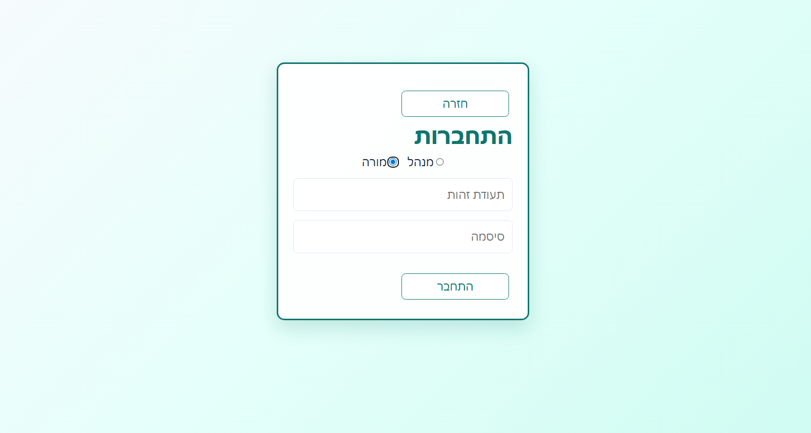
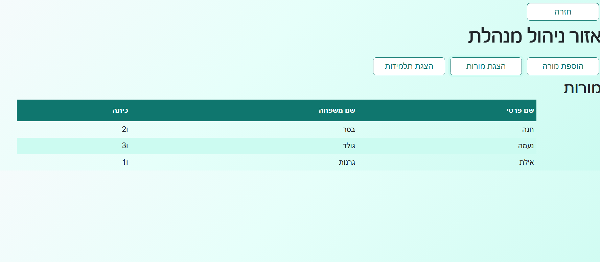
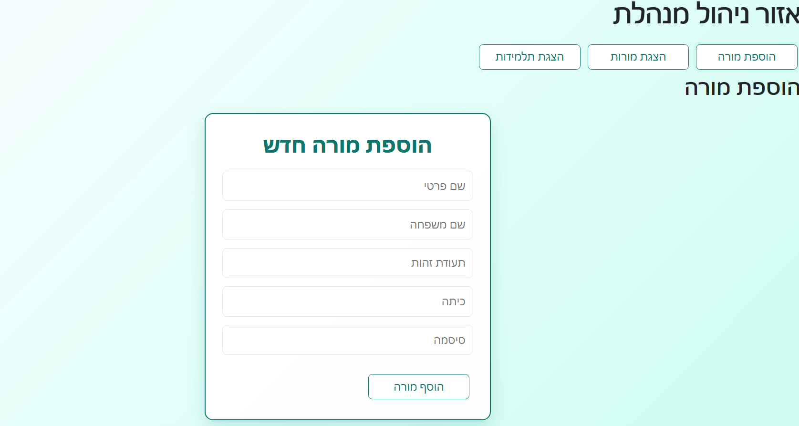
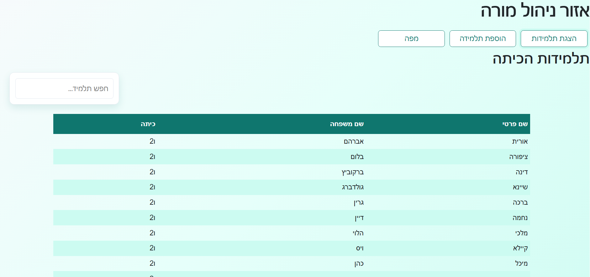
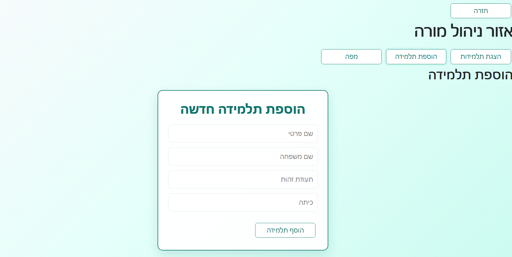
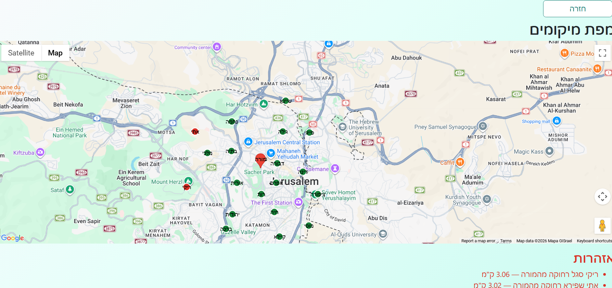

# מערכת לניהול טיול שנתי

הפרויקט הוא מערכת לניהול טיול שנתי עבור בית הספר "בנות משה".  
המערכת מאפשרת רישום תלמידות ומורות, שליפת נתונים לפי הרשאות, הצגת מיקומי המורה והתלמידות, וזיהוי תלמידות שהתרחקו מהמורה.

## תיאור הפרויקט

הפרויקט הוא מערכת לניהול טיול שנתי עבור בית הספר "בנות משה", המערכת מאפשרת רישום תלמידות ומורות וכן שליפות שונות ביניהם הצגת תלמידות והצגת מיקומי המורה והתלמידות וזיהוי תלמידות רחוקות בהתאם להרשאות.

## יכולות עיקריות

### מנהלת
- התחברות.
- הצגת רשימת תלמידות.
- הצגת רשימת מורות.
- הוספת מורה חדשה.

### מורה
- התחברות למערכת.
- הצגת תלמידות הכיתה שלה.
- הוספת תלמידה חדשה.
- צפייה במפה המציגה את מיקום המורה והתלמידות בזמן אמת.
- קבלת אזהרה עבור תלמידות שהתרחקו מעל 3 ק״מ מהמורה.

## טכנולוגיות

### צד לקוח
React + Vite, TypeScript, CSS, Google Maps API, Socket.IO Client

### צד שרת
Node.js, Express, PostgreSQL, Socket.IO, JWT

### כלי פיתוח ובדיקה
- Postman - בדיקת API במהלך הפיתוח.
- Git & GitHub - ניהול גרסאות והגשת הפרויקט.

## שיקולי בחירת טכנולוגיות

## שיקולי בחירת טכנולוגיות

- בחרתי ב־React כי צד הלקוח כולל כמה אזורים דינמיים כמו טפסים, טבלאות, דשבורדים ומפה. החלוקה לרכיבים עזרה לי לשמור על קוד מסודר וברור.
- בחרתי ב־Node.js ו־Express כי רציתי לבנות API פשוט וברור, עם הפרדה בין routes, controllers ו־middlewares.
- בחרתי ב־PostgreSQL כי הנתונים במערכת הם רלציוניים: מורות, תלמידות, כיתות ומיקומים. לכן מסד נתונים טבלאי מתאים כאן יותר ממבנה לא רלציוני.
- בחרתי ב־Socket.IO אחרי שבתחילת הפיתוח בדקתי אפשרות של Polling. המעבר ל־WebSocket איפשר לעדכן את המפה רק כאשר מתקבל מיקום חדש, במקום לשלוח בקשות חוזרות מהלקוח.


## מבנה הפרויקט

```txt
annual-trip/
│
├── annual-trip-client/
│   ├── src/
│   │   ├── api/
│   │   ├── components/
│   │   ├── pages/
│   │   ├── routes/
│   │   ├── services/
│   │   ├── styles/
│   │   ├── types/
│   │   ├── App.tsx
│   │   ├── main.tsx
│   │   └── socket.ts
│   │
│   └── package.json
│
├── annual-trip-server/
│   ├── controllers/
│   ├── db/
│   ├── middlewares/
│   ├── routes/
│   ├── simulators/
│   ├── utils/
│   ├── app.js
│   └── package.json
│
└── README.md
``` 

## ישויות מרכזיות וקשרי גומלין
המערכת מבוססת על מספר ישויות מרכזיות:

- מנהלת - משתמשת בעלת הרשאות ניהול, יכולה לצפות במורות ותלמידות ולהוסיף מורות.
- מורה - משתמשת המשויכת לכיתה מסוימת, ויכולה לצפות בתלמידות הכיתה שלה.
- תלמידה - משויכת לכיתה מסוימת, וניתן לעדכן עבורה מיקום אחרון.
- כיתה - משמשת לקישור בין מורה לתלמידות שלה.
- מיקום אחרון של מורה - נשמר בנפרד מנתוני המורה.
- מיקום אחרון של תלמידה - נשמר בנפרד מנתוני התלמידה.

קשרי הגומלין העיקריים:
- כל מורה משויכת לכיתה אחת.
- כל תלמידה משויכת לכיתה אחת.
- מורה יכולה לראות את התלמידות ששייכות לכיתה שלה.
- לכל מורה ולכל תלמידה נשמר מיקום אחרון לצורך הצגה על המפה וחישוב מרחק.


## הרצת צד השרת

יש להיכנס תיקיית השרת:

```bash
cd annual-trip-server
```

להתקין תלויות:
``` bash
npm install
```

להפעיל צד שרת:
``` bash
npm run dev
```
השרת ירוץ בכתובת:
http://localhost:3000


## הרצת צד הלקוח

יש להיכנס לתיקיית הלקוח:

```bash
cd annual-trip-client
```

להתקין תלויות:
``` bash
npm install
```

להפעיל צד לקוח:
``` bash
npm run dev
```
המערכת תפתח בכתובת:
http://localhost:5173

## סימולטור מיקומים

לצורך בדיקת מערכת המיקומים נכתב סימולטור המדמה שליחת מיקומים של מורות ותלמידות לשרת.

הסימולטור מאפשר לבדוק את עדכון המיקומים, את הצגת הנתונים על המפה, את עדכוני ה־WebSocket ואת מנגנון זיהוי התלמידות שהתרחקו מהמורה.

יש להריץ כל סימולטור בטרמינל נפרד:
בטרמינל ראשון:
```bash
cd annual-trip-server
node simulators/teacherDevicesSimlator.js
```

ובטרמינל נוסף:
```bash
cd annual-trip-server
node simulators/studentDevicesSimulator.js
```


## משתני סביבה
בתיקיית השרת יש ליצור קובץ `.env` עם הערכים הבאים:

```env
DB_HOST=localhost
DB_PORT=5432
DB_NAME=annual_trip_db
DB_USER=your_db_user
DB_PASSWORD=your_db_password

PORT=3000
JWT_SECRET=your_jwt_secret
ADMIN_USERNAME=admin_user_name
ADMIN_PASSWORD=admin_password

STUDENT_DEVICE_KEY=your_student_device_key
TEACHER_DEVICE_KEY=your_teacher_device_key
```

בנוסף, יש ליצור קובץ .env בתיקיית הלקוח:
```env
VITE_GOOGLE_MAPS_API_KEY=your_google_maps_api_key
```

## API מרכזיים

כל הבקשות יוצאות דרך `axiosClient`, עם כתובת בסיס:
`http://localhost:3000`

בנוסף, אם קיים token, הוא נשלח אוטומטית ב־Header:
`Authorization: Bearer <token>`

### התחברות

| Method | Route | Description |
|---|---|---|
| POST | `/auth/login` | התחברות למערכת - מנהל או מורה |

### ניהול מנהל

| Method | Route | Description |
|---|---|---|
| GET | `/admin/teachers` | שליפת כל המורות |
| GET | `/admin/students` | שליפת כל התלמידות |
| POST | `/admin/teacher` | הוספת מורה חדשה |

### פעולות מורה

| Method | Route | Description |
|---|---|---|
| GET | `/teacher/students` | שליפת תלמידות הכיתה של המורה |
| GET | `/teacher/students/:id` | שליפת תלמידה לפי מזהה |
| POST | `/teacher/student` | הוספת תלמידה חדשה |

### מפה ומיקומים

| Method | Route | Description |
|---|---|---|
| GET | `/teacher/map` | שליפת המורה ותלמידות הכיתה שלה עם המיקומים |

### עדכון מיקומים

| Method | Route | Description |
|---|---|---|
| POST | `/location/student/latest` | עדכון מיקום אחרון של תלמידה |
| POST | `/location/teacher/latest` | עדכון מיקום אחרון של מורה |


## צילומי מסך

### מסך התחברות


### לוח מנהלת



### הוספת מורה


### לוח מורה



### הוספת תלמידה


### מפת מיקומים



## ולידציות ואבטחה

- המערכת מבצעת בדיקות תקינות לשדות חובה בטפסים.
- מספר תעודת זהות נבדק כדי לוודא שהוא מכיל 9 ספרות.
- פעולות ניהול ומורה מוגנות באמצעות JWT.
- בקשות עדכון מיקום ממכשירי תלמידות ומורות מוגנות באמצעות device key.
- הטוקן נשלח מהלקוח לשרת באמצעות Authorization Header.


## הנחות והחלטות תכנון

### הנחות
- כל מורה משויכת לכיתה אחת.
- כל תלמידה משויכת לכיתה אחת.
- נשמר המיקום האחרון בלבד של כל תלמידה ומורה, ולא היסטוריית מיקומים מלאה.
- תלמידה נחשבת רחוקה מדי אם המרחק האווירי בינה לבין המורה גדול מ־3 ק״מ.
- לא מומשו פעולות עריכה ומחיקה, בהתאם לדרישת התרגיל שכללה שליפה והכנסה בלבד.

### החלטות תכנון
- הפרויקט חולק לצד לקוח וצד שרת כדי להפריד בין ממשק המשתמש לבין הלוגיקה העסקית ושמירת הנתונים.
- בצד השרת נעשתה הפרדה בין routes, controllers, middlewares ו־utils כדי לשמור על קוד מסודר וקל לתחזוקה.
- המיקומים נשמרים בטבלה/מבנה נפרד כדי להפריד בין נתוני משתמשים קבועים לבין נתוני מיקום שמשתנים בתדירות גבוהה.
- WebSocket נבחר עבור עדכוני מיקום כדי לאפשר לשרת לדחוף עדכונים ללקוח כאשר מתקבל מיקום חדש.
- בתחילת הפיתוח נבדקה אפשרות של Polling לעדכון המפה, אך בהמשך הוחלט לעבור ל־WebSocket כדי לאפשר עדכון מיידי יותר של המיקומים ולמנוע בקשות חוזרות מהלקוח כאשר אין שינוי בנתונים.
- חישוב המרחק בין המורה לתלמידות מתבצע באמצעות נוסחת Haversine, המתאימה לחישוב מרחק אווירי בין שתי נקודות לפי קווי אורך ורוחב.

## יוצרת הפרויקט

**חני פיינהנדלר**  
GitHub: https://github.com/gitCHANI2005